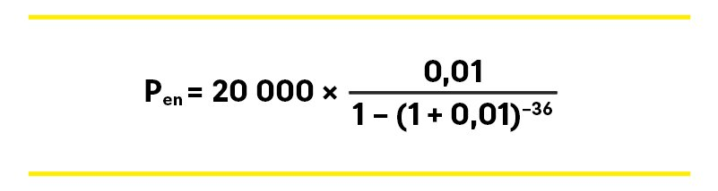

## Формула расчета аннуитета

Формула выглядит так:

Где:

* Pеп — размер ежемесячного платежа,
* Oск — остаток суммы кредита,
* ПС — месячная процентная ставка (рассчитывается как ставка по кредиту /100 *12),
* ПП (-1) — процентные периоды до окончания срока кредита (в месяцах).

Для расчета возьмем кредит на сумму 20000 рублей под 12% годовых, оформленный на 36 месяцев.

Рассчитаем процентную ставку в месяц (ПС) = 12/(100*12) = 0,01

Тогда

Формула взята [отсюда](https://www.raiffeisen.ru/wiki/kak-rasschitat-annuitetnyj-platezh/)